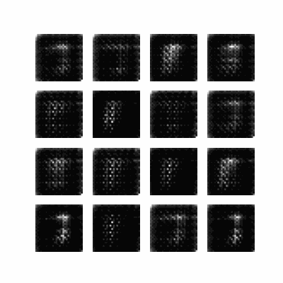
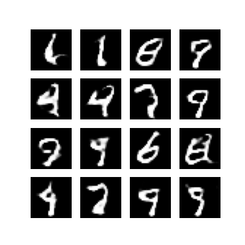

# gan-demo
A demo of GANs (Generative Adversarial Networks) using the MNIST dataset for generating handwritten digits. Trained in Google Colab.

# GIF of training over time

# Sample of generated images

